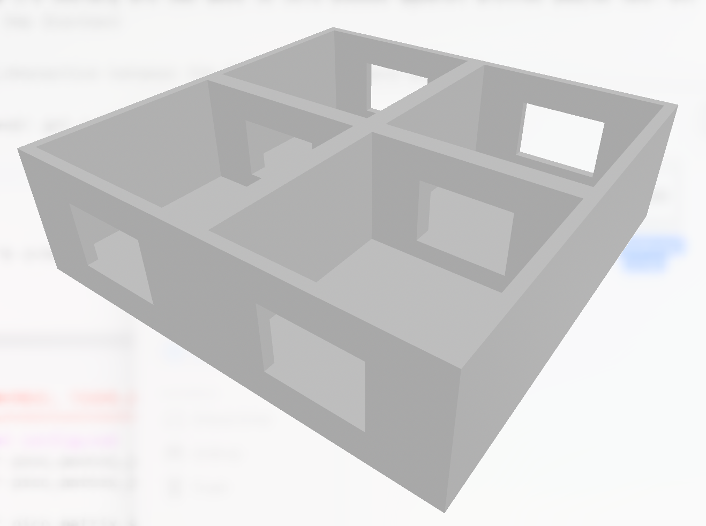
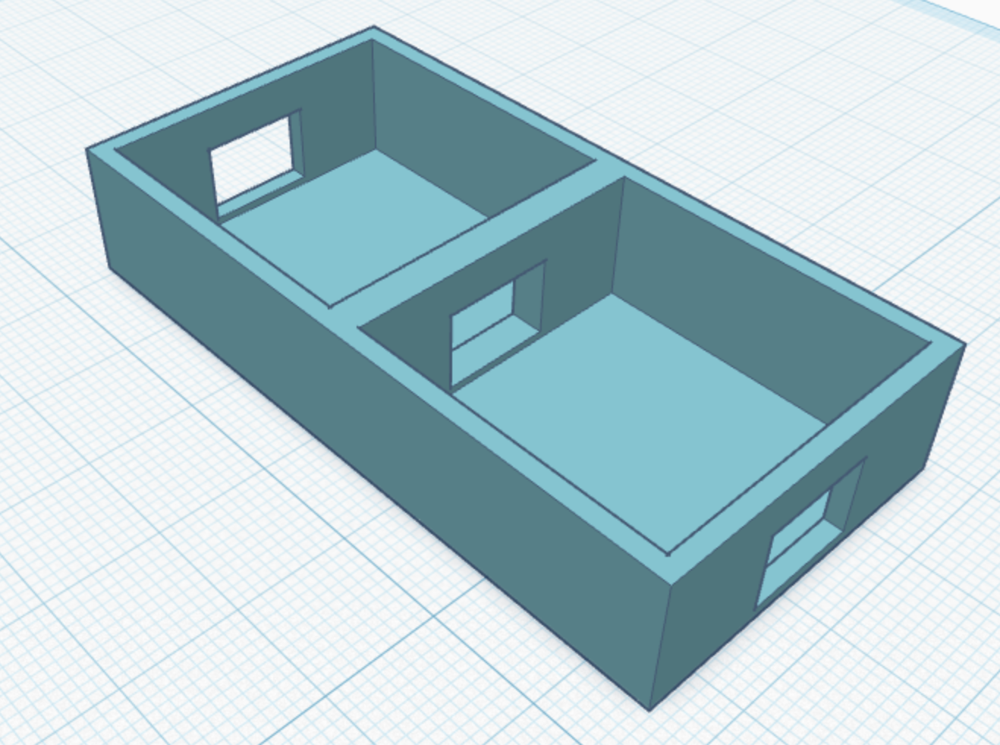
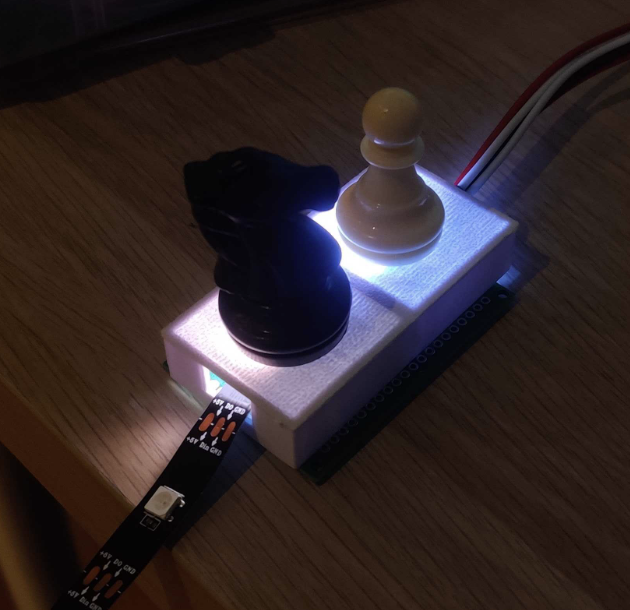
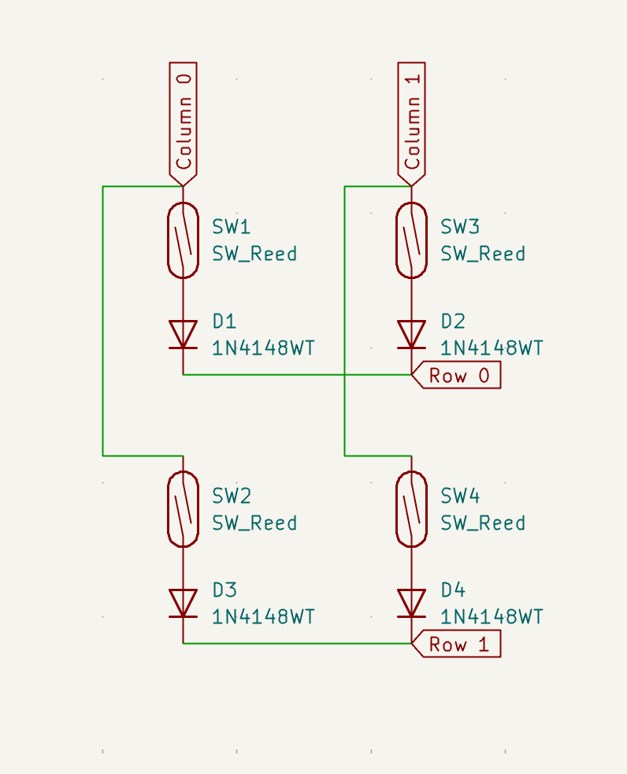
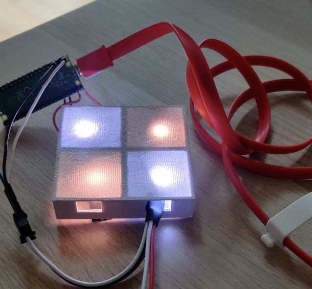

# chessboard journal

June 23: Spent 20mins creating a project brief and bill of materials

June 27: Spend 45mins writing a Python program to use `berserk` API to connect to LiChess and learn about the streamed events

July 2: looked for parts online from a variety of resellers

July 4: 
- ordered parts on Amazon
- used threading to make a basic Flask API to search for games
- added make move function
 
July 5: 
- got a basic API working and was able to move pieces against another player with it! 
- Learned the basics of Next.js and started making the frontend

July 6: got basic interaction between the frontend & backend working!

July 7: 
- parts arrived! 
- got a basic code with reed switches to work. 
- Designed a prototype for 4 chessboard squares in TinkerCAD.

- Next, I tested my NeoPixels, and I need to find a way to diffuse them better.

- This design wasn't as good for the reed switch height, so I did another one which was less tall and thinner surface, and tested with 2 squares.

- This also lights up better, and fits the reed switch!

July 8: 
- 3D printed a 4-square version of the new design. 
- Drew up a KiCad schematic of the matrix layout!

- Soldered the reed switches in a matrix layout
- Got the 2x2 mini board to work!
- Wrote a custom matrix keypad library based on an existing one to output an array which i can use

July 9 - Created a home page with Next.js (learned about Tailwind CSS and shadcn/ui)

July 10:
- Fixed a duplicate move issue in the frontend
- Soldered pins to my Raspberry Pi (decided to use a Zero 2W as it's smaller)
- Flashed the SD card for the Pi and configured the OS
- Compiled Stockfish on the Pi
- Got Stockfish best move analysis to show on the frontend!

July 12: Set up the Pi touchscreen & X11

July 13:
- Designed a full-size chessboard in TinkerCAD and added a section for the Pi, screen & Pico (had to split it into multiple pieces to print)
- Printed the end section which stores the Pi, Pico and screen
- Worked on the backend, creating a class for Stockfish game and API routes for it

July 14:
- Printed the chessboard squares
- Soldered the display pins (messed this up so had to redo it) and NeoPixel strip to the Pi
- Tested the NeoPixel strip with the Pi
- Lots of debugging to get the screen to work (messed up pins, framebuffers, and bridging!)
- Software work - added human vs human game routes to the API and integrated them into the frontend
- Compiled the Next.js app
- Designed a KiCAD schematic for the full size matrix

July 15:
- Used a guillotine to cut the protoboards to size
- Soldered the reed switches to the protoboard
- Soldered wires for the matrix columns

July 16:
- Soldered all diodes to the matrix
- Soldered row wires
- Added the Pico pinout of rows & columns to my KiCAD schematic
- Soldered the column & rows to the Pico 
- Tested the matrix, many squares didn't work so I had to resolder loose wires etc.

July 17:
- Got all the matrix keys to work after much testing, resoldering and alignment!
- Laser cut a base and base spacer
- Tried to put the NeoPixels in and failed, so made the holes bigger
- Soldered the NeoPixels and put them in through the reed switches
- Started testing the NeoPixels

July 18: soldered & fixed some NeoPixels that didn't work

July 19:
- Got all the NeoPixels to work!
- Deployed the frontend to Vercel and ran it `DISPLAY=:0 surf -F https://chessboard-moa.vercel.app/`

July 20:
- Got all the reed switches and NeoPixels to work
- Hot glued the protoboards to the 3D printed chessboard
- Hot glued the screen enclosure to this
- Soldered Pico UART to the Pi
- Wrote READMEs for the frontend & backend

### AI usage
AI helped me with:
- understanding the LiChess API and its responses
- choosing parts to order (comparing datasheets)
- learning Next.js
- help me setup the Pi desktop and framebuffer
- Exporting the Next.js site as static HTML
- Creating a UI to test reed switches (not shipped in the final code)
- Using UART hardware Serial on the Pico
