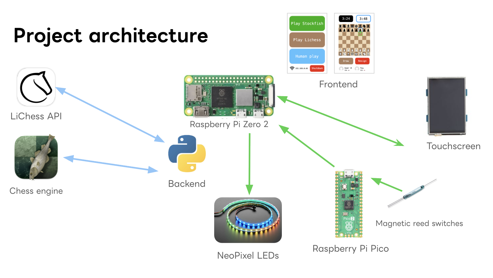

# chessboard

## what is this?
An electronic chessboard to play against others online, chess engines, or others in person (and get hints)!

## why did I build it?
I love playing chess, and one of the best ways to improve is with practice against others or a computer. However, this normally requires playing online, which is more distracting. I wanted to build a chessboard where I could play with anyone in the world or with a computer on a traditional board.

## how it works
The chessboard is controlled by a Raspberry Pi (Zero 2 W), which runs the backend API, LEDs, main hardware loop & displays the frontend. 

Reed switches are read by a Raspberry Pi Pico and data is transmitted to the main Pi over UART.

## how to set up
Follow the instructions in each folder (backend, frontend, cad and pico_matrix_scan)'s README to deploy each module!

So far, only playing against the chess engine works, with more features coming soon!

A bill of materials can be found in BOM.csv.

## my build journey
Throughout the project, I kept a journal at [JOURNAL.md](https://github.com/duckida/chessboard/blob/main/JOURNAL.md)!

AI usage is also declared in JOURNAL.md.
